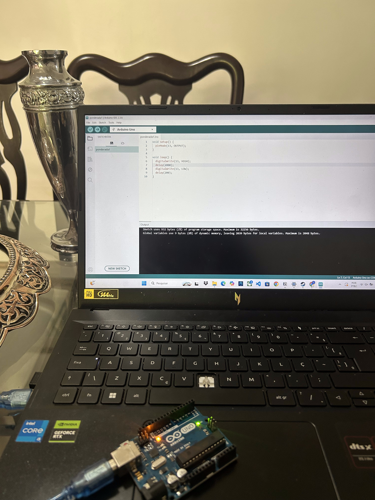
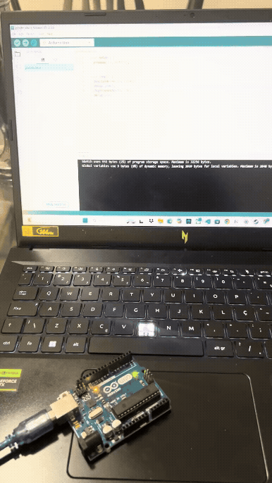
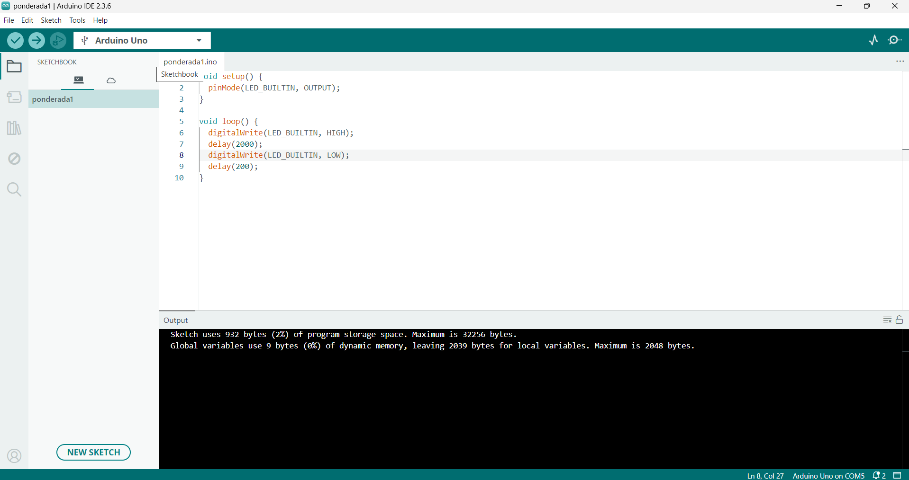

# Pisca pisca

## Parte 1




## Parte 2
```
void setup()
{
  pinMode(10, OUTPUT);
}

void loop()
{
  digitalWrite(10,HIGH);
  delay(200);
  digitalWrite(10, LOW);
  delay(200);
}
```
link Tinkercad : <a href="https://www.tinkercad.com/things/jyvwNOTr3Q3/editel?returnTo=%2Fdashboard&sharecode=Co1qmWAzYHMTUEZCGWG3dzr6yS0fQuzVtH5QSZoPwEg">Link para o Google</a>
